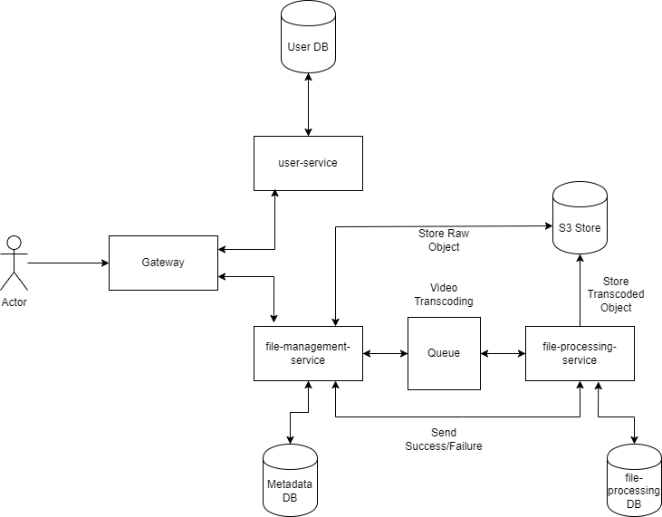
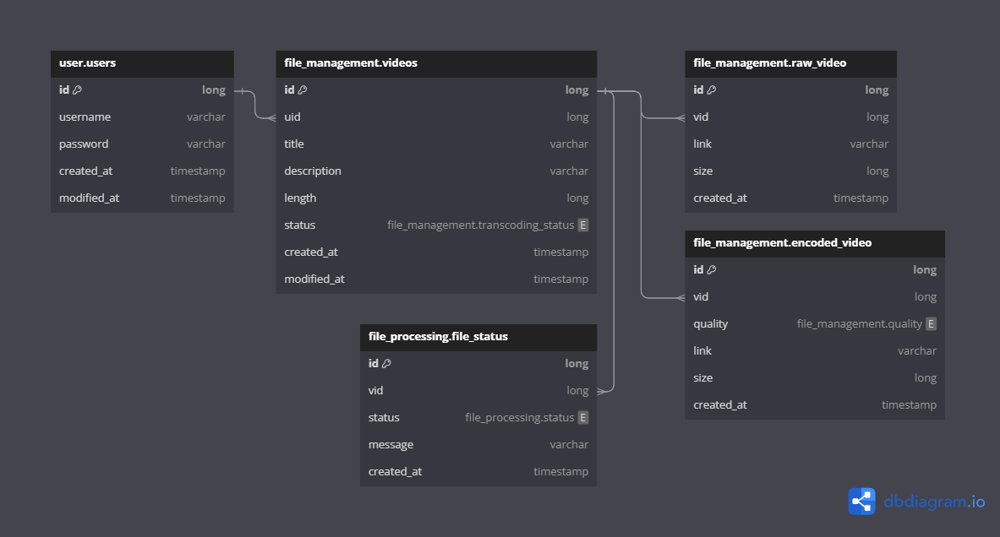

# YT Clone Design

<!-- TOC -->
* [YT Clone Design](#yt-clone-design)
  * [Introduction](#introduction)
  * [Requirements](#requirements)
  * [High Level Design](#high-level-design)
    * [Video Storage (S3 Storage)](#video-storage-s3-storage)
    * [Video Transcoding Events](#video-transcoding-events)
    * [Database](#database)
    * [Authentication](#authentication)
    * [Services](#services)
    * [Client](#client)
  * [Database Design Diagram](#database-design-diagram)
  * [Detailed Design](#detailed-design)
    * [1. User Authentication](#1-user-authentication)
    * [2. Video Upload](#2-video-upload)
    * [3. Video Processing](#3-video-processing)
  * [Code Repos](#code-repos)
  * [References](#references)
<!-- TOC -->

## Introduction

This document designs a simple YT clone which will be implemented in multiple phases.

YouTube is a video sharing platform which allows users to upload and view videos as well as share and comment on them.

The project is only meant for learning and not to build and exact replica.

## Requirements
* Users should be able to log in/register.
* Users can upload videos when logged in.
* Videos should be transcoded to multiple formats.
* Users can view videos without being logged in.
* Users can watch videos.
* Video playback should be in chunks and not the whole file at once.

## High Level Design

### Video Storage (S3 Storage)
S3 Storage will be used to store raw and encoded videos. Object storage has been the go-to for most applications and 
has a really wide community supporting it, so it only makes sense to do the same for this project.

### Video Transcoding Events
When a video is uploaded, a message will be published to a Queue, namely ActiveMQ Artemis in this case. 
This will allow us to process the videos asynchronously.

### Database
All the services will have their own instance of DB to follow the microservice architecture. (Although I will be 
using a single instance with multiple databases for now).

For databases, I will be using PostgreSQL.

### Authentication
For AuthN/AuthZ, I will be using Keycloak to handle the login/registration and managing the tokens.

### Services
There is no specific language that I will be using for the microservices but for now this is what I have planned.
* File-Management Service - Java (Spring Boot)
* File-Processing Service - Golang
* User Service            - C#? (Maybe?)

### Client
No plans on designing the client just yet.

## Database Design Diagram

## Detailed Design

### 1. User Authentication
The user authentication in our case will be handled by Keycloak.
Keycloak gives us the flexibility to easily integrate with OpenID Connect, SAML based platforms like GitHub, Facebook, 
Google, etc. with ease.
This way I won't need to handle each Identity Provider on my own.
The services can just use the keycloak server as the authentication server while they themselves act as a resource server.
User registration can also be handled through keycloak.

### 2. Video Upload
I would let a user upload videos if and only if they are authenticated.
Users would be allowed to upload videos and these videos can be stored in a separate S3 Bucket where will be only store 
the raw unprocessed videos.
Using a service like S3 provides us with the ability to change providers as needed. e.g. I can easily change from 
Amazon S3 to lets say Minio storage or Ceph storage.

### 3. Video Processing
Assuming that I will get large amounts of video uploads, I would not want the users to wait around for the upload and 
processing to finish and have their viewing experience blocked.
Due to such a scenario I would be asynchronously processing the videos so that the users are not blocked. I will be using 
a messaging queue here, i.e. ActiveMQ Artemis in this case but any queuing system can be used.
The video processing will start and end asynchronously through a queue message, the raw video will be pulled from S3 storage 
and transcoded. The then transcoded videos will be uploaded back to S3 storage to a different bucket.
A message will be sent back with either a success or failure status.

## Code Repos
* File-Management Service: https://github.com/cant-code/yt-clone-file-management
* File-Processing Service: https://github.com/cant-code/yt-clone-video-processing

## References
* Golang Queue Client: https://pkg.go.dev/github.com/go-stomp/stomp/v3
* Spring Resource Server: https://docs.spring.io/spring-security/reference/servlet/oauth2/resource-server/jwt.html