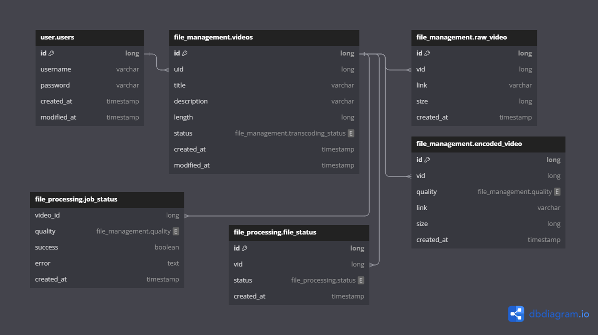

# YT Clone Design

## Introduction

This document designs a simple YT clone which will be implemented in multiple phases.

YouTube is a video sharing platform which allows users to upload and view videos as well as share and comment on them.

The project is only meant for learning and not to build and exact replica.

## Requirements
* Users should be able to log in/register.
* Users can upload videos when logged in.
* Videos should be transcoded to multiple formats.
* Users can view videos without being logged in.
* Users can watch videos.
* Video playback should be in chunks and not the whole file at once.

## High Level Design

### Video Storage (S3 Storage)
S3 Storage will be used to store raw and encoded videos. Object storage has been the go-to for most applications and 
has a really wide community supporting it, so it only makes sense to do the same for this project.

### Video Transcoding Events
When a video is uploaded, a message will be published to a Queue, namely ActiveMQ Artemis in this case. 
This will allow us to process the videos asynchronously.

### Database
All the services will have their own instance of DB to follow the microservice architecture. (Although we will be 
using a single instance with multiple databases for now).

For databases, I will be using PostgreSQL.

### Authentication
For AuthN/AuthZ, I will be using Keycloak to handle the login/registration and managing the tokens.

### Services
There is no specific language that I will be using for the microservices but for now this is what I have planned.
* File-Management Service - Java (Spring Boot)
* File-Processing Service - Golang
* User Service            - C#? (Maybe?)

### Client
No plans on designing the client just yet.

## Database Design Diagram

## Detailed Design

// TODO

## Code Repos
* File-Management Service: https://github.com/cant-code/yt-clone-file-management
* File-Processing Service: https://github.com/cant-code/yt-clone-video-processing

## References
* Golang Queue Client: https://pkg.go.dev/github.com/go-stomp/stomp/v3
* Spring Resource Server: https://docs.spring.io/spring-security/reference/servlet/oauth2/resource-server/jwt.html